# CodeSync — Backend

> A real-time collaborative code editor platform built with a **.NET 8 microservices architecture**. CodeSync lets developers write, run, version-control, and review code together — all in the browser.

---

## Table of Contents

- [Overview](#overview)
- [Architecture](#architecture)
- [Use Case Diagram](#use-case-diagram)
- [Microservices](#microservices)
- [Tech Stack](#tech-stack)
- [Getting Started](#getting-started)
- [Environment Variables](#environment-variables)
- [API Ports (Local)](#api-ports-local)
- [Running Tests](#running-tests)
- [Project Structure](#project-structure)
- [Contributing](#contributing)
- [License](#license)

---

## Overview

CodeSync is a full-stack collaborative development platform. The backend is split into **8 independent microservices**, each with its own database, JWT-secured REST API, and Swagger documentation. Services communicate via HTTP clients and real-time events via **SignalR**.

Key capabilities:

- JWT authentication with Google & GitHub OAuth
- Role-based access (User / Admin)
- Real-time collaborative editing with **Operational Transformation (OT)**
- Sandboxed code execution via **Docker**
- File & project management
- Threaded inline code comments
- Snapshot-based version control with **diff support**
- Email & real-time push notifications

---

## Architecture

The system follows a **microservices pattern** where each service is independently deployable, owns its PostgreSQL database, and communicates with other services over HTTP or WebSocket (SignalR).

```
┌──────────────────────────────────────────────────────────┐
│                      Frontend (Angular)                  │
└────────────────────────┬─────────────────────────────────┘
                         │ REST + WebSocket
        ┌────────────────┼─────────────────┐
        ▼                ▼                 ▼
  AuthService      CollabService    ExecutionService
  (JWT / OAuth)    (SignalR + OT)   (Docker runner)
        │
  ┌─────┼──────────────────────┐
  ▼     ▼          ▼           ▼
ProjectService  FileService  CommentService
                               │
                    VersionService  NotificationService
                                    (MailKit + SignalR)
```

Every service shares the same **JWT secret** for stateless inter-service authentication. Redis is optionally wired into CollabService for horizontal SignalR scaling.

---

## Use Case Diagram

The diagram below shows all actors and their interactions across the platform.



> **Actors:** Guest · Registered User · Admin  
> **Key use cases span:** Authentication, Project Management, Real-time Collaboration, Code Execution, File Operations, Version Control, Comments, and Notifications.

---

## Microservices

| Service | Port | Responsibility |
|---|---|---|
| **AuthService** | 5157 | Registration, login, JWT issuance, Google/GitHub OAuth, admin panel |
| **ProjectService** | 5257 | Create/manage projects, membership, roles |
| **FileService** | 5357 | File CRUD within projects, content storage |
| **CollabService** | 5457 | Real-time collaborative editing via SignalR + Operational Transformation |
| **VersionService** | 5557 | Snapshot-based version history, diff between versions (DiffPlex) |
| **ExecutionService** | 5657 | Queue-based sandboxed code execution via Docker, multi-language support |
| **CommentService** | 5757 | Inline threaded comments on files |
| **NotificationService** | 5857 | In-app notifications + email via MailKit (SignalR push) |

Each service exposes **Swagger UI** at `/swagger` and is secured with **Bearer JWT**.

---

## Tech Stack

| Layer | Technology |
|---|---|
| Language | C# / .NET 8 |
| Framework | ASP.NET Core 8 Web API |
| Database | PostgreSQL (via EF Core + Npgsql) |
| Real-time | SignalR (WebSockets) |
| Auth | JWT Bearer, BCrypt, Google OAuth 2.0, GitHub OAuth |
| Code Execution | Docker.DotNet (sandboxed containers) |
| Diff Engine | DiffPlex |
| Email | MailKit / SMTP |
| Caching / Scale | Redis (optional, for SignalR backplane) |
| Code Quality | SonarQube |
| Testing | xUnit + coverlet |
| API Docs | Swagger / Swashbuckle |

---

## Getting Started

### Prerequisites

- [.NET 8 SDK](https://dotnet.microsoft.com/download/dotnet/8.0)
- [PostgreSQL](https://www.postgresql.org/) (one DB per service, or one shared DB with separate schemas)
- [Docker](https://www.docker.com/) (required for ExecutionService)
- [Redis](https://redis.io/) *(optional — only needed for multi-instance CollabService)*

### 1. Clone the repository

```bash
git clone https://github.com/your-username/CodeSync.git
cd CodeSync
```

### 2. Configure environment variables

Copy and fill in the `appsettings.json` for each service (see [Environment Variables](#environment-variables) below), or use `dotnet user-secrets` / environment variables directly.

### 3. Run database migrations

Run this command inside each service folder:

```bash
cd AuthService
dotnet ef database update

cd ../ProjectService
dotnet ef database update

# Repeat for all services...
```

### 4. Start all services

Open 8 terminal windows (or use a process manager) and run each service:

```bash
# Terminal 1
cd AuthService && dotnet run

# Terminal 2
cd ProjectService && dotnet run

# Terminal 3
cd FileService && dotnet run

# Terminal 4
cd CollabService && dotnet run

# Terminal 5
cd VersionService && dotnet run

# Terminal 6
cd ExecutionService && dotnet run

# Terminal 7
cd CommentService && dotnet run

# Terminal 8
cd NotificationService && dotnet run
```

All services will auto-apply pending migrations on startup.

---

## Environment Variables

Each service reads from `appsettings.json`. The key values to fill in are:

```json
{
  "ConnectionStrings": {
    "DefaultConnection": "Host=localhost;Database=codesync_auth;Username=postgres;Password=yourpassword"
  },
  "Jwt": {
    "Key": "your-very-long-secret-key-min-32-chars",
    "Issuer": "CodeSync",
    "Audience": "CodeSyncUsers",
    "ExpiryDays": 7
  }
}
```

**AuthService** additionally requires:

```json
{
  "OAuth": {
    "Google": { "ClientId": "", "ClientSecret": "" },
    "GitHub": { "ClientId": "", "ClientSecret": "" }
  },
  "Frontend": { "BaseUrl": "http://localhost:4200" }
}
```

**NotificationService** additionally requires:

```json
{
  "Email": {
    "UseFakeSmtp": "false",
    "From": "noreply@codesync.com",
    "SmtpHost": "smtp.gmail.com",
    "SmtpPort": "587",
    "Username": "your-email@gmail.com",
    "Password": "your-app-password"
  }
}
```

**CollabService** optionally:

```json
{
  "Redis": {
    "ConnectionString": "localhost:6379"
  }
}
```

> **Important:** Never commit real credentials. Use environment variables or secrets management in production.

---

## API Ports (Local)

| Service | HTTP Port | Swagger |
|---|---|---|
| AuthService | 5157 | http://localhost:5157/swagger |
| ProjectService | 5257 | http://localhost:5257/swagger |
| FileService | 5357 | http://localhost:5357/swagger |
| CollabService | 5457 | http://localhost:5457/swagger |
| VersionService | 5557 | http://localhost:5557/swagger |
| ExecutionService | 5657 | http://localhost:5657/swagger |
| CommentService | 5757 | http://localhost:5757/swagger |
| NotificationService | 5857 | http://localhost:5857/swagger |

---

## Running Tests

The `CodeSync.Tests` project contains unit tests for all services.

```bash
cd CodeSync.Tests
dotnet test
```

To run with coverage:

```bash
dotnet test --collect:"XPlat Code Coverage" --settings ../coverlet.runsettings
```

---

## Project Structure

```
CodeSync/
├── AuthService/                  # JWT auth, OAuth, user management
│   ├── Controllers/
│   │   ├── AuthController.cs
│   │   ├── OAuthController.cs
│   │   └── AdminController.cs
│   ├── Services/
│   ├── Models/
│   ├── DTOs/
│   ├── Repositories/
│   └── Migrations/
│
├── ProjectService/               # Project & membership management
├── FileService/                  # File CRUD & storage
│
├── CollabService/                # Real-time collaboration
│   ├── Hubs/CollabHub.cs         # SignalR hub
│   ├── Services/OTService.cs     # Operational Transformation engine
│   └── Workers/SessionCleanupWorker.cs
│
├── VersionService/               # Snapshots & diffs
├── ExecutionService/             # Code runner (Docker-based)
│   ├── Workers/ExecutionWorker.cs
│   └── Hubs/ExecutionHub.cs
│
├── CommentService/               # Inline threaded comments
│
├── NotificationService/          # Email + real-time notifications
│   ├── Hubs/NotificationHub.cs
│   └── Clients/AuthServiceClient.cs
│
├── CodeSync.Tests/               # xUnit test project
├── CodeSync.sln                  # Solution file
└── coverlet.runsettings          # Coverage config
```

---

## Contributing

1. Fork the repository
2. Create your feature branch: `git checkout -b feature/your-feature`
3. Commit your changes: `git commit -m "Add your feature"`
4. Push to the branch: `git push origin feature/your-feature`
5. Open a Pull Request

Please follow the existing code style and make sure all tests pass before submitting.

---

## License

This project is licensed under the MIT License. See the [LICENSE](LICENSE) file for details.

---

<p align="center">Built with ❤️ using .NET 8 · PostgreSQL · SignalR · Docker</p>
